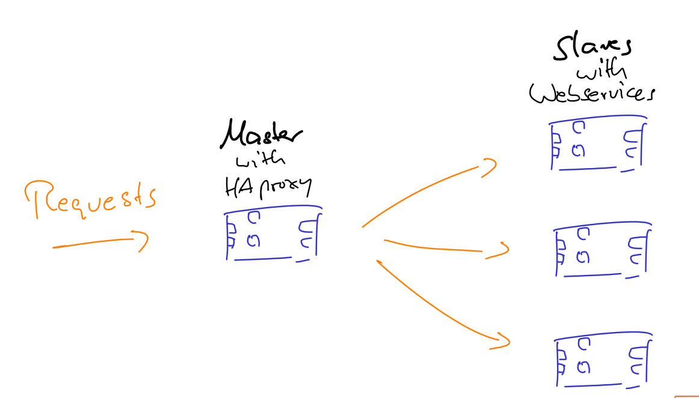

Loadbalancing with HAproxy
==========================

This use case is about to use HAproxy as loadbalancer for several webservers.

We use [Registrator from Gliderlabs](https://github.com/gliderlabs/registrator) to recognize new Docker containers that also offer a website. These new containers are registered in consul, which is globally available in the Hypriot Cluster Lab. Next, [consul-template](https://github.com/hashicorp/consul-template) recognize that a new webserver is up and tells the IP address of the new webserver to HAproxy.
Thus, HAproxy always automatically knows about all available webservers and will forward incoming requests sequentially to all of them (following round-robin strategy).



Let's do it step by step
------------------------

- Make sure that the hostname of the cluster's master node is called `master`. To do so, use our [flash tool](https://github.com/hypriot/flash) to define the hostname when flashing the SD card.
- Login via SSH to all nodes of your cluster and make sure you have the latest Docker tools installed:
```
sudo apt-get update && sudo apt-get upgrade 
```
When you are asked for updating the Docker config file or not, type `N` and finally reboot.

- Login via SSH to the master node of your cluster, e.g. the node with hostname `master`, with user `pi` and password `raspberry`.

- Checkout this repository:

```
git clone https://github.com/hypriot/rpi-cluster-demo.git
```

- Change to subfolder of this demo

```
cd rpi-cluster-demo/loadbalancing_with_haproxy
```

- Set Docker Swarm 
```
export DOCKER_HOST=tcp://192.168.200.1:2378
```

- Setup Haproxy, consul-template and registrator:

```
docker-compose -p loadbalancing up -d
```

This creates all necessary services and also start one webservers 

- Now spin up some webservers 
 
```
docker-compose -p loadbalancing scale demo-hostname=X
```

with `X` as the number of webservers. Note that as of today the Docker daemon can only handle up to 30 containers on one Raspberry Pi by default. Thus `X` should be 30 times the number of your RPis at max.

- Open browser at IP of master node and restart page. Every page should show a new website with a new hostname because HAproxy is configured to follow the **round-robin** strategy. Thus, for every incoming HTTP request HAproxy forwards each request to a new node.


Additional commands
--------------------
- Permanently set environment variables for Swarm:

  `export DOCKER_HOST=tcp://192.168.200.1:2378`

- Unset DOCKER_HOST variable

  `unset DOCKER_HOST`


Reset your environment
----------------------

Execute the following command in the folder in which the *.yml* file resides:

```
DOCKER_HOST=tcp://192.168.200.1:2378 docker-compose -p loadbalancing down
```

